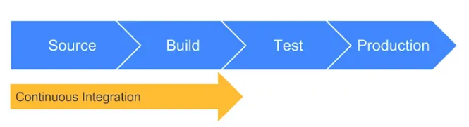
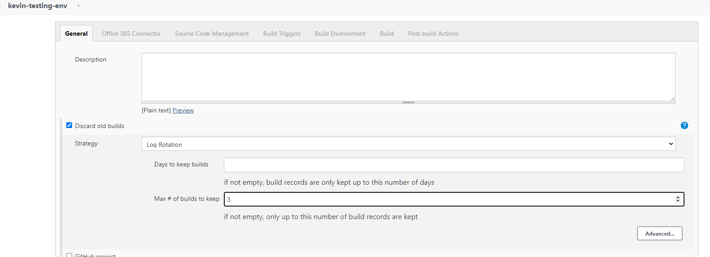

`10-07-23 - Week 6` 

# Topic of the week CI/CD pipeline

## what it is? 
```
continous intergration and continous deployment pipeline is a set of practices and tools that automate the process of building, testing and delpoying software applications.
```
## why is it important for businesses/ business value  ? 
```
faster time to market 
early bug detection - testing intergration
collaboration and efficiency 
quality assurance 
risk reduction - less human input 
```

# Whats is Jenkins?
```
  A tool that automates repatative tasks and facilitating CI and CD practices.
  open source automation server providng wide range of plugins and intergration making it highly customizable and flexible for building pipelines.

```

## other tools used for CI/CD
```
GitLab
Travis CI
Circle CI
Azure DevOps
AWS CodePipeline
GitHub Actions
TeamCity
```
## why build a pipeline ?

```
Essential to streamline and automate the software development and delivery processes. 

It enables consistent and efficient execution of tasks such as code integration, building, testing, and deployment. 

By implementing a pipeline, organizations can ensure faster and more reliable delivery of software updates, improved quality control, and efficient collaboration among development teams.
```

**Software Development Life Cycle (SDLC)**

`plan - design - develop - test - deploy`

```
planning is important to create a strong foundation. 
building a pipeline to add new features to the app and release new features using CI/CD pipeline to allow faster time to market from 3 days automation to 3 minutes.
```
# The architecture 


```
1. Code is on local host 

2. created a SSH key pair and pushed to GITHUB (SCP/gitclone) 
(key for account of github syncing account)

3. webhook - automated the process of pushing code to next stage without manual push. everytime we make a local change.

4. generate SSH from GITHUB to Jenkins (key for repo sync for app code)
```
**This is continuous Intergration**
```
5. test the code: add a payment gateway 

6. master node - central server that manages overall system.

(automatated test before production)

7. agent node - secondary node, seperate machine or virtual env connected to jenkins master as worker to offload tasks.

8. test passed - push to production (if it fails it goes back to CI)

9. pushed to aws on a EC2 instance using SSH (port 22 and add additional port to allow push from jekins)
```

`DevOps - Set of practices that automate the processes between software development and IT teams, in order that they can build, test, and release software faster.`

`CI CD is considered as the backbone of DevOps practices and automation`

# Continuous intergration
```
Developers merge/commit code to master branch multiple times a day, fully automated build and test process which gives feedback within few minutes, 
```

# continuous delivery
```
is an extension of continuous integration,  on top of having automated your testing, you also have automated your release process and you can deploy your application at any point of time by clicking on a button. In continuous Delivery the deployment is completed manually.
```

# continuous deloyment 
```
extension to continuous delivery, with this practice, every change that passes all stages of your production pipeline is released to your customers, there is no human intervention, and only a failed test will prevent a new change to be deployed to production.
```


Using generated key on .ssh folder copy public key inside github repo settinggs and delop key 

log into jenkins and create new item

build job 
console output and check for success





